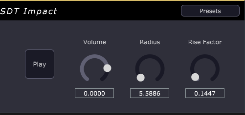
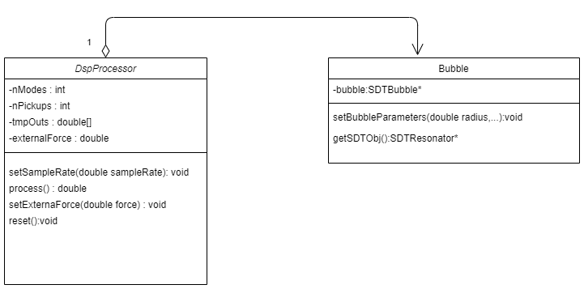

<!-- omit in toc -->
# Sound Design Toolkit - Bubble Model VST3 Plugin
<!-- omit in toc -->
### A plugin realization of the bubble model from the [Sound Design Toolkit](http://www.soundobject.org/SDT/) created with [JUCE](https://juce.com/)

<!-- omit in toc -->
## Contents
- [Introduction](#introduction)
- [Bubble Model](#bubble-model)
    - [Description](#description)
- [Bubble Model Plugin](#bubble-model-plugin)
    - [Software Architecture](#software-architecture)

 
 
## Introduction

The Sound Design Toolkit consists in a library of ecologically founded (e.g physics based) sound synthesis algorithms.

In this project the entire SDT library is ported in C++ and integrated in the JUCE framework for the realization of a VST3 plugin version of the impact model.

## Bubble Model

### Description

Acoustic emission in water and other liquids are provoked by gas trapped in bubbles. An upcoming bursting bubble in water forms a hollow resonator. The frequency of the dominant
resonant peak changes with the depth of the pit and the “sharpness” of the resonance is related to its flatness. To model this bubble we ca use a pure sine wave with a frequency-envelope tuned according to the resonance development. An amplitude-envelope creates initial and terminating impulses and accounts for the decaying peak levels. The resulting equation for the pressure wave created by the bubble is

Frequency, decay time and relative amplitude of each bubble can be derived from its radius and depth.

## Bubble Model Plugin

The bubble model plugin was implemented by taking as a reference the sdt.bubble Max/Msp patch from the Sound Design Toolkit. 

The bubble creation algotihm simulates the sound created by a bubble in a liquid by implementing the exponentially decaying sinusoidal oscillator.

### Software Architecture

The SDT library is ported in C++ through the creation of a series of class wrappers, this to preserve modularity. The DSP audio processing has been separated from the resonators and interactors methods, in this way we have a template to use for all the SDT class wrappers. The audio processing in the DspProcess class is a sample-by-sample processing, the creation of the buffer is delegated to the processBlock method of the PluginProcessor class. The software architecture is the following:

The final audio processing is realized by the processBlock method of the Pluginprocessor class, this method is called in the main audio thread of the plugin. To connect the user parameters, that can be changed in the GUI, in a safe way a real time audio processing logic is implemented in the plugin :

The parameters are stored in atomic lock-free variables so to prevent the use of mutex or other techniques that could block the main thread.

